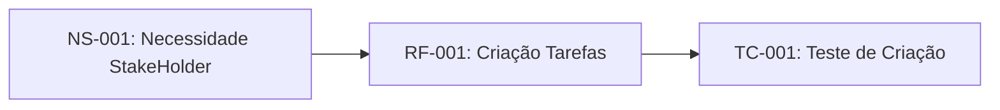

# Sistemas de Gestão de Tarefas

## 1. Introdução

### 1.1 Propósito do Projeto

Este documento especifica os requisitos funcionais e não-funicionais para o Sistema de Gestão de Tarefas (SGT), seguindo o padrão IEEE 29148:2018.

### 1.2 Escopo

O SGT permitirá que usuários criem, organizem e acompanhem tarefas pessoais e profissionais com sistema de prioridade e prazos.

### 1.3 Definição e Acrônimos
  
- **SGT**: Sisema de Gestão de Tarefas
- **RF**: Requisito Funcional
- **NRF**: Requisito Não-Funcional
- **Sprint**: Período de 2 semanas de desenvolvimento

### 1.4 Referências

- IEEE 28148:2018 - Systems and Softwares engineering
- CMMI for Development. Version 2.0.
  
## 2. Descrição Geral

### 2.1 Perspectiva do Produto

O SGT será uma aplicação web responsiva com sincronização em nuvens.

### 2.2 Funções Principais

- Criação e Edição de Tarefas (NS-001)
- Organização para o projeto e tags
- Sistema de notificação
- Relatório de Produtividade

## 3. Requisitos Específicos

### 3.1 Requisitos Funcionais

#### RF-001: Criação de Tarefas

**Descrição**: O sistema deve permitir que usuários creim tarefas com título, descrição, data de vencimento e prioridade
**Prioridade**: ALta
**Versão** 1.0
**Data**: 2026-03-27
**Rastreabilidade**: Derivado da necessidade do stake holder NS-001

**Critérios de Aceitação**

- [ ] Formulário com Campos Obrigatórios (título) e Opcionais
- [ ] Validação de data (não permitir datas passadas)
- [ ] Níveis de prioridade: Baixa, média, alta
- [ ] Confirmação Visual após criação

**Dependências**: Nenhuma

---

#### RF-002: Organização por Projetos

**Descrição**: O sistema deve permitir agrupas tarefas personalizados
**Prioridade**: Média
**Versão** 1.0
**Data**: 2026-03-27
**Rastreabilidade**: Derivado da necessidade do stake holder NS-002

**Critérios de Aceitação**

- [ ] Usuário pode criar, renomear e excluir projetos
- [ ] Tarefas podem ser atribuidas á um ou nenhum projeto
- [ ] Vuizualização filtrada por projeto

**Dependências**: RF-001

---

#### RF-003: Alterar a Tarefa para o Status de Concluido

**Descrição**: O sistema deve permitir alterar a tarefa para outros status, principalmente para concluido
**Prioridade**: Média
**Versão** 1.0
**Data**: 2026-04-10
**Rastreabilidade**: Derivado da necessidade do stake holder NS-001

**Critérios de Aceitação**

- [ ] Usuário pode Alterar a tarefa para concluído
- [ ] Tarefas podem retonar para Não Concluídas
- [ ] Vuizualização filtrada por status (Concluídas e Não Concluídas)

**Dependências**: RF-001

---

### 3.2 Requisitos Não-Funcionais

#### RNF-001: Desempenho

**Descrição**: O sistema deve carregaar a lista de tarefas em menos de um segundo até 100 tarefas.
**Categoria**: Desempenho
**Prioridade**: Alta
**Versão**: 1.0
**Métrica**: Tempo de resposta < 1s para 95% das requisições

---
#### RNF-002: Segurança

**Descrição**: O sistema deve implementar autenticação OAuth 2.0 e criptografia TLS 1.3
**Categoria**: Segurança
**Prioridade**: Crítica
**Conformidade**: LGPD, ECA Digital

---

## 4.0 Controle de Versões

### 4.1 Histórico de Alterações

| Versão | Data | Autor | Modificação |
|--------|------|-------|-------------|
|1.0 |2026-03-27| Eduardo Nicolete | Versão inicial do documento|

### 4.2 Rastreabilidade

Infográfico de Rastreabilidade do Requisito

